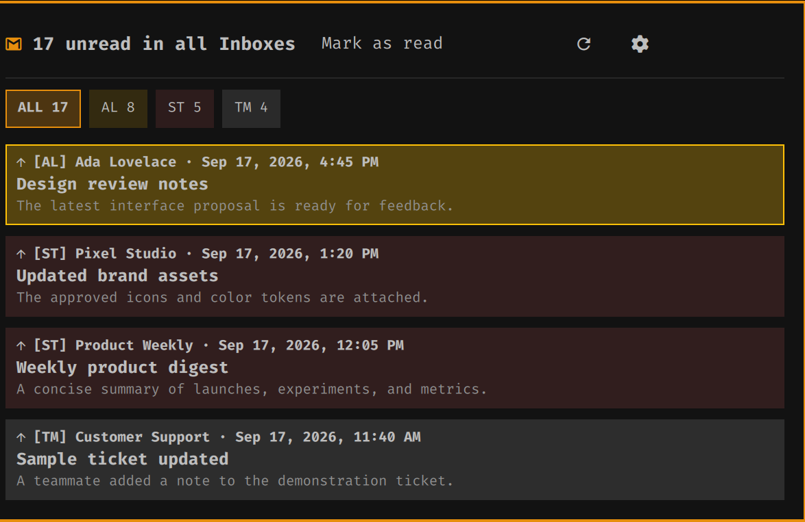

# Gmailbox

Gmailbox is an Omarchy Quickshell bar plugin that shows Gmail unread counts, account badges, message previews, and locally cached conversation text from the Gmail sessions already open in your browser. It does not use OAuth, request a Google password, or keep a separate Gmail session.

## Preview



The preview uses fictional `.test` accounts and sample messages; it contains no real mailbox data.

## Features

- Automatic multi-account discovery from verified Gmail pages.
- Rotating unread badge in the Omarchy bar and a combined inbox popup.
- Direct links that open the selected Gmail conversation rather than the generic Inbox.
- Local desktop-notification ingestion while Gmail tabs are closed.
- Optional plain-text body cache for conversations the user has already opened; enabled by default and bounded to the configured per-account message limit.
- Semantic account colors that update immediately with the active Omarchy theme.
- Local “Mark as read” tranquility state that never modifies Gmail remotely.
- Configurable `SUPER+SHIFT+<letter>` shortcut and full keyboard navigation.
- Localized interface for 19 languages.

## Requirements

- Omarchy Quattro with the plugin-enabled Quickshell shell.
- Node.js, Python 3, `pkexec`, and `xdg-settings` from the standard Omarchy environment.
- Google Chrome, Chromium, or Brave with an existing Gmail session.
- A browser restart after installing, updating, or removing the local bridge extension.

The browser bridge uses the bundled signed CRX and a Native Messaging host. Installing or removing the system extension registration requests explicit polkit authorization through `pkexec`.

## Installation

```bash
omarchy plugin add https://github.com/avillagran/omarchy-gmailbox --enable
```

Open Gmailbox preferences from the bar, select **Install in browser**, approve the polkit prompt, and restart the browser once. Open each Gmail account normally so Gmailbox can verify and discover it. The installation does not ask for Gmail credentials and does not copy browser cookies.

## Usage

- Click the bar widget to open or close the inbox popup.
- Press `TAB` to rotate account tabs.
- Press `LEFT` or `RIGHT` to change account.
- Press `UP` or `DOWN` to select a message; the list follows the selection.
- Press `SPACE` to expand or collapse the selected cached message.
- Press `ENTER` to open the selected conversation in Gmail.
- Press `,` to open preferences and `LEFT` to return to the inbox.
- The optional default shortcut is `SUPER+SHIFT+Q`; its letter is configurable in preferences.

## Local data and privacy

Gmailbox reads only `https://mail.google.com/*` pages through its local extension. The extension sends snapshots to `io.github.avillagran.gmailbox`, a Native Messaging host on the same machine. Gmailbox does not transmit mail data to an external service.

Preferences are stored in `~/.config/omarchy/gmailbox.json`. Bounded message previews and optional plain-text conversation bodies are stored in `~/.cache/omarchy/gmailbox/` with user-only permissions. Full bodies are captured only after the user opens the conversation in Gmail; Gmailbox never opens hidden conversations to collect them because that could change Gmail read state. Disable **Download email content** to purge cached bodies.

The extension permissions are limited to Native Messaging, tabs, scripting, alarms, and `https://mail.google.com/*`. The plugin and extension execute as unsandboxed local code, like other Omarchy plugins, so review the source and declared capabilities before installation.

## External dependencies and privileged actions

Gmailbox depends on the local browser and Omarchy tools listed under Requirements. It makes no network download during plugin setup. The only privileged action is writing or removing the browser’s external-extension registration under `/opt/google/chrome/extensions/`; the UI runs the bundled fixed-path installer through `pkexec` after explicit user action.

## Removal

Remove the browser bridge and generated shortcut before removing the plugin:

```bash
PLUGIN="$HOME/.config/omarchy/plugins/io.github.avillagran.omarchy-gmailbox"
node "$PLUGIN/bin/gmailbox-bridge-install.js" --uninstall
pkexec "$PLUGIN/bin/gmailbox-bridge-system-install.sh" --uninstall
node "$PLUGIN/bin/gmailbox-keybind.js" --uninstall
omarchy plugin remove io.github.avillagran.omarchy-gmailbox
```

Restart the browser to complete extension removal. User preferences and cache are deliberately retained. Delete them only when you no longer want the saved configuration or previews:

```bash
rm -f ~/.config/omarchy/gmailbox.json
rm -rf ~/.cache/omarchy/gmailbox
```

## License

MIT — see [LICENSE](LICENSE).
