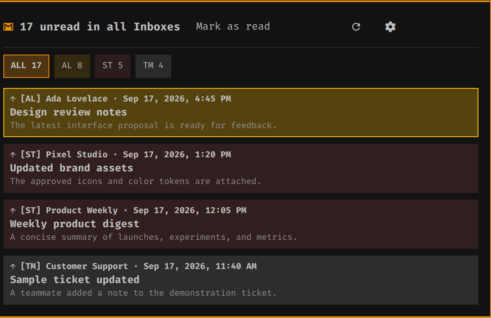

# Mailbox

Mailbox is an Omarchy Quickshell bar plugin that shows Gmail and HEY unread counts, account badges, message previews, and locally cached conversation text from the email sessions already open in your browser. It does not use OAuth, request an email password, or keep a separate email session.

## Preview



The preview uses fictional `.test` accounts and sample messages; it contains no real mailbox data.

## Features

- Automatic Gmail multi-account discovery and HEY account discovery from verified open pages.
- Rotating unread badge in the Omarchy bar and a combined inbox popup.
- Direct links that open the selected Gmail or HEY conversation rather than the generic Inbox.
- Local desktop-notification ingestion while Gmail and HEY tabs are closed.
- Per-account notification health in Preferences; a warning opens the provider account so blocked browser notifications can be enabled.
- Optional plain-text body cache for conversations the user has already opened; enabled by default and bounded to the configured per-account message limit.
- Semantic account colors that update immediately with the active Omarchy theme.
- Local “Mark as read” tranquility state that never modifies email remotely.
- Configurable `SUPER+SHIFT+<letter>` shortcut and full keyboard navigation.
- Localized interface for 19 languages.

## Requirements

- Omarchy Quattro with the plugin-enabled Quickshell shell.
- Node.js, Python 3, and `xdg-settings` from the standard Omarchy environment.
- Google Chrome, Chromium, or Brave with an existing Gmail or HEY session.
- A one-time manual **Load unpacked** action in the browser's Extensions page.

The browser bridge uses a user-owned Native Messaging host and the bundled unpacked extension source. It never asks for administrator access or installs system browser policies. Chrome, Chromium and Brave deliberately require the user to enable Developer mode and select the unpacked folder in their own browser.

## Installation

```bash
omarchy plugin add https://github.com/avillagran/omarchy-mailbox --enable
```

Open Mailbox preferences from the bar and select **Prepare bridge**. This writes only user-owned Native Messaging manifests. The extension folder path is shown below the bridge status and can be selected/copied. In **the same browser selected as the default**, open `chrome://extensions` (in Brave use `brave://extensions`), turn on **Developer mode**, click **Load unpacked**, and select the displayed `bridge-extension/source` directory (the directory containing `manifest.json`). Confirm that **Mailbox Local Bridge** is enabled. Restart the browser once so the Native Messaging host is picked up, then open each Gmail account and the HEY Imbox normally. Mailbox verifies and discovers those pages; it does not ask for email credentials or copy browser cookies.

After a plugin update, click **Reload** on the Mailbox Local Bridge card in the Extensions page and refresh the mail pages. Reloading an unpacked extension updates its background script and content scripts; a browser restart alone does not reliably do this. If the browser profile changes, load the extension in that profile too. Do not move or delete the installed plugin directory while the extension is loaded. If Mailbox warns about a legacy system registration from an earlier release, have an administrator remove that registration first; preparing the user-owned host cannot override a system-enforced extension.

## Usage

- Click the bar widget to open or close the inbox popup.
- Press `TAB` to rotate account tabs.
- Press `LEFT` or `RIGHT` to change account.
- Press `UP` or `DOWN` to select a message; the list follows the selection.
- Press `SPACE` to expand or collapse the selected cached message.
- Press `ENTER` to open the selected conversation in its email provider.
- Press `,` to open preferences and `LEFT` to return to the inbox.
- The optional default shortcut is `SUPER+SHIFT+Q`; its letter is configurable in preferences.

## Local data and privacy

Mailbox reads only `https://mail.google.com/*` and `https://app.hey.com/*` pages through its local extension. The extension sends snapshots to `io.github.avillagran.mailbox`, a Native Messaging host on the same machine. Mailbox does not transmit mail data to an external service.

Preferences are stored in `~/.config/omarchy/mailbox.json`. Bounded message previews and optional plain-text conversation bodies are stored in `~/.cache/omarchy/mailbox/` with user-only permissions. Full bodies are captured only after the user opens the conversation in Gmail or HEY; Mailbox never opens hidden conversations to collect them because that could change remote read state. Disable **Download email content** to purge cached bodies.

The extension permissions are limited to Native Messaging, tabs, scripting, alarms, `https://mail.google.com/*`, and `https://app.hey.com/*`. The plugin and extension execute as unsandboxed local code, like other Omarchy plugins, so review the source and declared capabilities before installation.

## External dependencies and browser setup

Mailbox depends on the local browser and Omarchy tools listed under Requirements. It makes no network download during plugin setup and never executes as root. The user explicitly prepares a per-user Native Messaging host and loads the unpacked extension in the browser UI. Loading an unpacked extension requires enabling browser Developer mode. The bundled CRX is not used by this installation path.

## Removal

First remove **Mailbox Local Bridge** from each browser profile in `chrome://extensions` (or `brave://extensions`). Then remove the local host and generated shortcut **before** removing the plugin:

```bash
PLUGIN="$HOME/.config/omarchy/plugins/io.github.avillagran.omarchy-mailbox"
node "$PLUGIN/bin/mailbox-bridge-install.js" --uninstall
node "$PLUGIN/bin/mailbox-keybind.js" --uninstall
omarchy plugin remove io.github.avillagran.omarchy-mailbox
```

Restart the browser to complete extension removal. Existing users who previously installed a system-wide Chrome external registration must ask their system administrator to remove that legacy registration separately; the new rootless installer cannot modify system directories. User preferences and cache are deliberately retained. Delete them only when you no longer want the saved configuration or previews:

```bash
rm -f ~/.config/omarchy/mailbox.json
rm -rf ~/.cache/omarchy/mailbox
```

## License

MIT — see [LICENSE](LICENSE).
